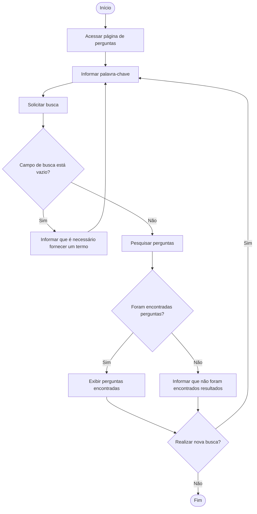

# Diagrama de Atividades - Busca de perguntas

Este diagrama representa o fluxo de atividades realizado durante uma busca de perguntas por palavra-chave no ESM Forum.

## Descrição

O fluxo começa quando o usuário acessa a página de perguntas e informa uma palavra-chave.

Antes de realizar a pesquisa, o sistema verifica se foi informado um termo. Caso o campo esteja vazio, uma mensagem é apresentada e o usuário pode informar uma palavra-chave.

Quando existe um termo válido, o sistema realiza a busca. Se forem encontradas perguntas correspondentes, os resultados são exibidos. Caso contrário, o usuário é informado de que não foram encontrados resultados.

Após a apresentação do resultado, o usuário pode realizar uma nova pesquisa ou encerrar a interação.
