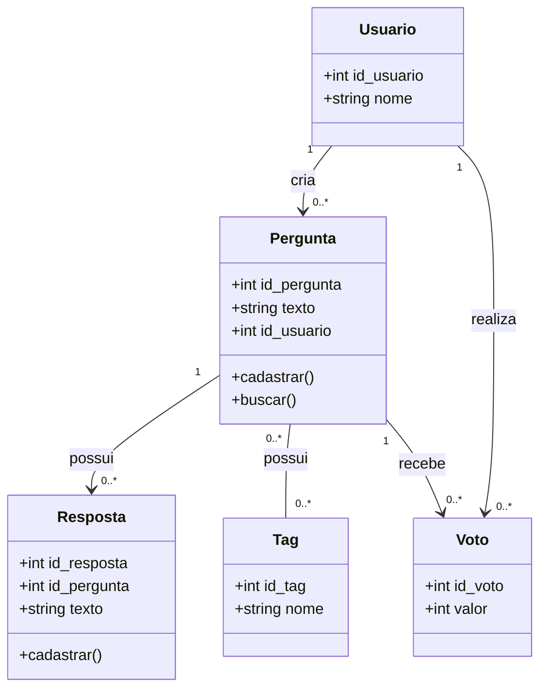

# Diagrama de Classes - ESM Forum

O diagrama abaixo representa as principais entidades do ESM Forum, considerando a estrutura atual do sistema e as funcionalidades propostas para sua evolução.

## Descrição

- **Usuario:** representa o usuário que participa do fórum.
- **Pergunta:** representa uma pergunta cadastrada e permite operações relacionadas ao cadastro e à busca.
- **Resposta:** representa as respostas associadas às perguntas.
- **Tag:** permite categorizar as perguntas de acordo com seus assuntos.
- **Voto:** representa a avaliação positiva ou negativa realizada por um usuário em uma pergunta.

Os relacionamentos apresentam as multiplicidades entre as entidades, permitindo representar a estrutura necessária para as funcionalidades consideradas nesta etapa do projeto.
