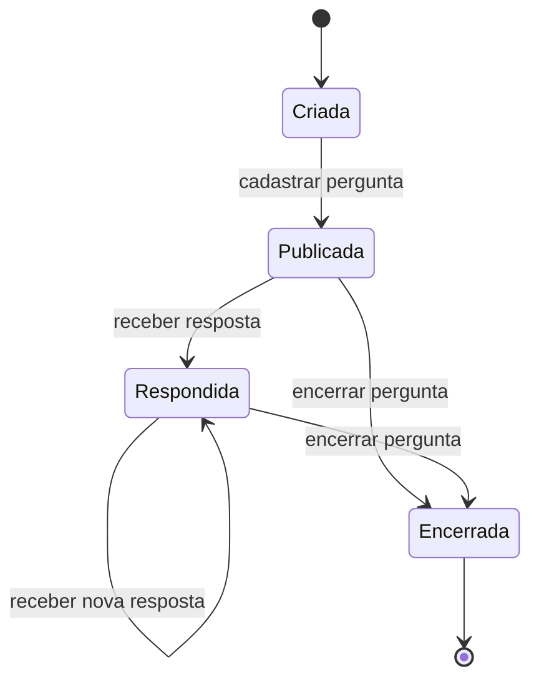

# Diagrama de Estados - Pergunta

Este diagrama representa possíveis estados de uma pergunta no ESM Forum durante seu ciclo de vida.

## Descrição

Uma pergunta inicia seu ciclo de vida no estado **Criada**, enquanto está sendo cadastrada no sistema.

Após o cadastro, passa para o estado **Publicada**, ficando disponível para visualização pelos usuários do fórum.

Quando recebe uma resposta, passa para o estado **Respondida**. Novas respostas podem ser adicionadas sem alterar esse estado.

Por fim, uma pergunta pode passar para o estado **Encerrada**, representando que não receberá novas interações.

O diagrama apresenta de forma simplificada o ciclo de vida de uma pergunta e as transições possíveis entre seus estados.
