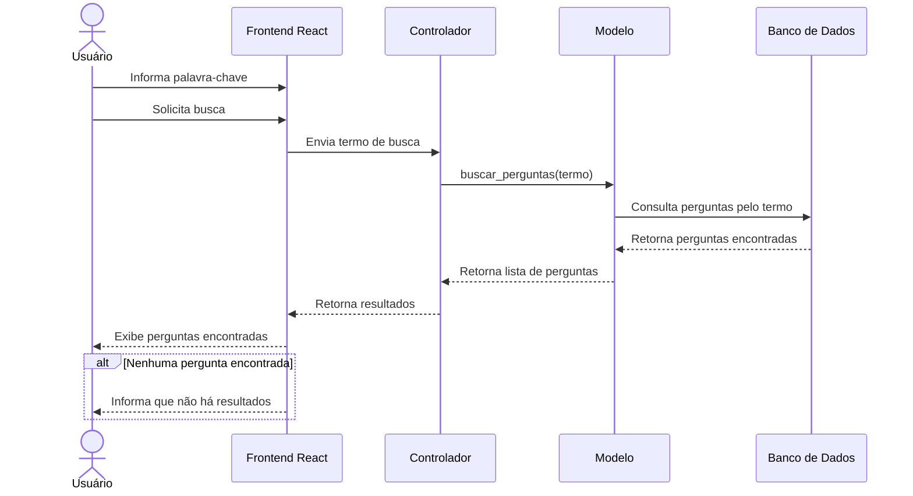

# Diagrama de Sequência - Busca de perguntas

Este diagrama representa a interação entre os componentes do ESM Forum durante a busca de perguntas por palavra-chave.

## Descrição

O usuário informa uma palavra-chave na interface do ESM Forum. O frontend envia o termo ao controlador, que solicita ao modelo a realização da busca.

O modelo consulta o banco de dados e retorna as perguntas correspondentes. O resultado percorre novamente as camadas da aplicação até ser apresentado ao usuário.

Caso nenhuma pergunta corresponda ao termo pesquisado, a interface informa que não foram encontrados resultados.
